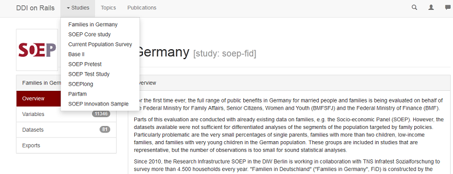

User Guide
==========

**Draft version**

This is a guide how to use the data portal DDI on Rails, which builds
the foundation for the new version of SOEPinfo.

DDI on Rails is created in order to assist the user to explore survey
data (e.g. the SOEP), to compile personalized datasets and to publish
the results on the publication database. Primarily, it guides the user
throughout the entire process of their research projects using the SOEP
data from conception to publication and citation.

Search Engine
-------------

On the main page a search option can be found, providing a quick way to
be navigated directly to the respective results if the user has a
specific variable, dataset, or topic in mind. It also helps for a quick
overview if the user's interest is to find out if there is any data
available for his/her research topic/question.

For instance, if you are looking for at the results for the keyword
"age", you can find a total of 2614 items listed. However, this might be
overwhelming. Thus, it provides you a way to narrow your search output,
using so-called facets. Possible classes above the total results are
"Concepts", "Variables", "Questions" and "Publications" - each of them
with optimized facets for the particular class.

The select box for studies is the only one, available in all views. This
makes it easy for the data users of one particular study to consistently
adjust all result views. The descriptions to those studies can be found
on the very top of the page under "Studies" after a particular study is
selected and will be specified in the next section again.

The already mentioned classes with its assigned symbols are listed again
underneath the "Study" option and below that another sorting option
regarding the analysis unit can be selected.

|image0|

Studies
-------

DDI on Rails incorporates various SOEP-studies, including "SOEP Core
study", "SOEPlong", "Families in Germany", "SOEP Innovation Sample",
"SOEP Pretest", "Base II", and "SOEP Test Study". A particular study can
be accessed as shown in the picture below. After a study of interest is
selected, a general overview will be displayed. Moreover, the total
number of involved variables and datasets can be viewed.

In the variable browser, there is another search engine adapted to the
chosen study. That way you can find your required variables in the
particular study. The same holds for the dataset browser. Furthermore,
the variables can be selected according to the desired analysis unit or
period on the left-hand side.

|image1|

Topics and Concepts
-------------------

A variety of topics can be selected on the very top of every page next
to "Studies". After clicking on a particular topic, several subtopics
appear. The user may also use the search engine to look for specific
concepts regarding the chosen topic.

Concepts are used to group variables within one study or in between
multiple studies, that might have slight variation but still put
themselves forward to be analysed in a comparative way. They replace the
so-called "item correspondence" from the former SOEPinfo.

|image2|

Publications
------------

Under "publications" you can search for any keyword and you will be
directed to a list of papers that involve the searched word(s). Each
result provides a link to the publication for direct access.

|image3|

Workspace and Basket
--------------------

While the former SOEPinfo allowed the use of the basket and its script
generator without any login information, the new system requires you to
log in in order to create baskets for variables.

The login is necessary to enable some of the new features in DDI on
Rails, among others the possibility to store multiple baskets at a time
and access those baskets directly from most statistical packages.

|image4|

After having signed in, a new basket-symbol appears on the very top. Now
you can create new baskets and fill in the individual information for
each basket. To enable comparison between studies and distributions
(versions of one study) later in the process, it is necessary to bind
the basket to a particular distribution.

|image5|

All variables of interest accessed as previously explained can be
selected into your basket now by clicking on the green "Add to basket"
symbol underneath the variable in the variable browser. The number next
to the basket indicates how many variables are already integrated into
your basket.

|image6|

